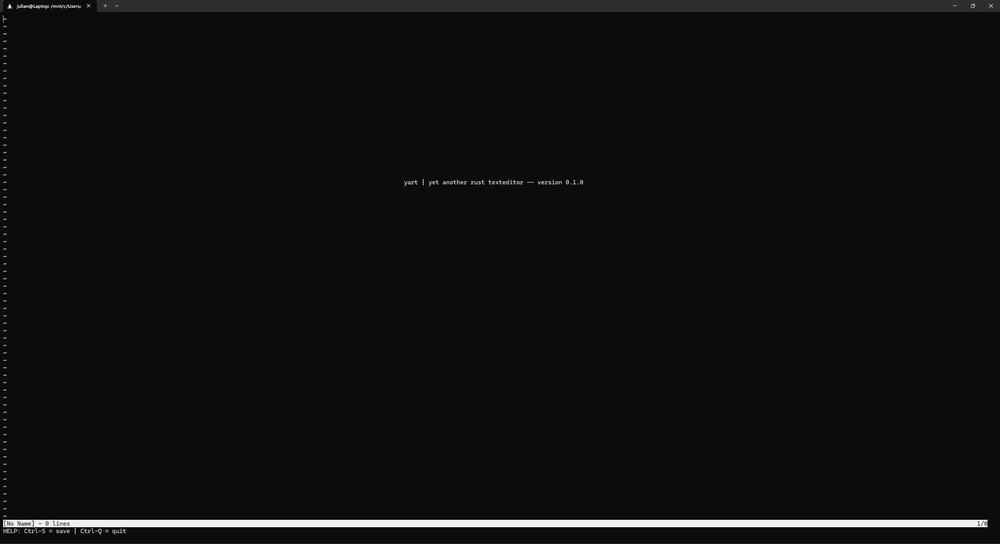
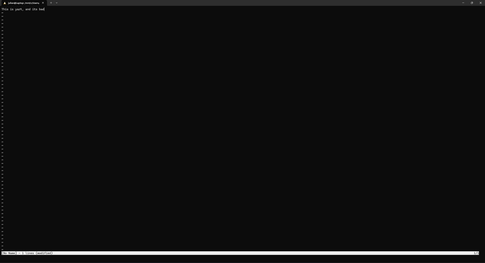

## yart | Yet another Rust texteditor
 

yart is a ***low productivity***, ***low fidelity***, ***low customizablity*** text editor that has its focus firm on ***user discomfort*** - specifically made for writing text (no way, right?).

### Features

- Written in Rust
- Thats all, I'm afraid...

### Supported Platforms
I only managed to get yart working with Linux. Feel free to add cross plattform support!

### Special thanks
To [barnii77](https://github.com/barnii77) for inspiring me to learn Rust

### Random quote

